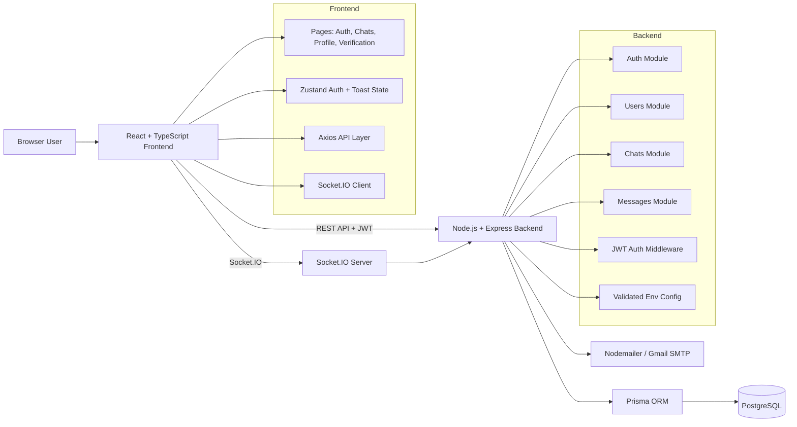

# Architecture

This project is implemented as a modular monolith:
- one frontend application
- one backend application
- one PostgreSQL database
- real-time communication layered on the backend using Socket.IO

## High-Level Diagram

## Request / Data Flow

### Authentication Flow
1. User registers or logs in from the frontend.
2. Backend validates credentials and returns a JWT.
3. Frontend stores the token and sends it in the `Authorization` header.
4. Express middleware validates the JWT and attaches `req.user`.

### Chat Flow
1. Authenticated user searches for another user.
2. Frontend creates or opens a direct chat through the backend.
3. Frontend fetches chats and messages through REST endpoints.
4. New messages are created through REST for persistence.
5. Socket.IO broadcasts live message events, delivery updates, read updates, typing events, and online presence.

### Recovery / Verification Flow
1. Backend creates a signed or random token record for password reset or email verification.
2. Backend stores the hashed token and expiry in the database.
3. Nodemailer sends an email using Gmail SMTP.
4. User opens the frontend link, submits the token-backed action, and the backend verifies and completes the flow.

## Backend Module Breakdown

### Auth Module
Responsibilities:
- register
- login
- current user
- forgot password
- reset password
- email verification
- resend verification

### Users Module
Responsibilities:
- search users
- update profile
- change password
- upload profile photo

### Chats Module
Responsibilities:
- create or fetch direct chat
- fetch current user chats

### Messages Module
Responsibilities:
- send message
- fetch messages
- edit message
- delete message
- mark delivered
- mark read

## Frontend Structure

### Pages
- `LoginPage`
- `RegisterPage`
- `ForgotPasswordPage`
- `VerifyEmailPage`
- `ChatsPage`
- `ProfilePage`

### Shared UI / Logic
- reusable avatar component
- message status component
- toast viewport
- socket hook for chat events
- validation utilities

## Database Model Summary

### User
Stores:
- account data
- profile data
- password hash
- email verification state
- password reset token metadata

### Chat
Stores:
- chat metadata
- chat type

### ChatParticipant
Links users to chats.

### Message
Stores:
- content
- sender
- timestamps
- deletion state
- delivery/read status

## Real-Time Design

The backend uses Socket.IO user rooms and chat rooms:
- user room pattern: `user:<userId>`
- chat room pattern: `<chatId>`

This enables:
- direct message delivery to participants
- online presence tracking
- read receipt fanout
- typing indicator fanout

## Key Design Decisions

### Modular Monolith Over Microservices
Chosen to keep the challenge solution understandable, maintainable, and easy to run locally while still preserving clear separation of concerns.

### REST For Persistence, Socket.IO For Realtime
Messages are persisted through the API first, then broadcast in real time. This keeps the source of truth on the backend and avoids client-only message state.

### Prisma As Data Access Layer
Prisma keeps data access consistent and readable while making schema evolution easier for a challenge that spans multiple phases.

### JWT For Session Handling
This keeps the auth model simple and works well for browser-based protected API calls in this challenge scope.

## Scalability Considerations

The current solution is intentionally simple, but it is structured to evolve:
- modules can be expanded without rewriting the whole backend
- Socket.IO user rooms already support better event targeting
- the database model can grow into group chat later
- route-level tests are in place for safer iteration

## Current Limitations

- no group chat
- no media sharing
- no scheduled messages
- no Google auth
- no browser notifications
- no infinite scroll
- no end-to-end encryption
- no public/private groups

## Notes For Reviewers

This project prioritizes:
- correctness
- separation of concerns
- incremental evolution across phases
- working end-to-end flows over premature complexity
